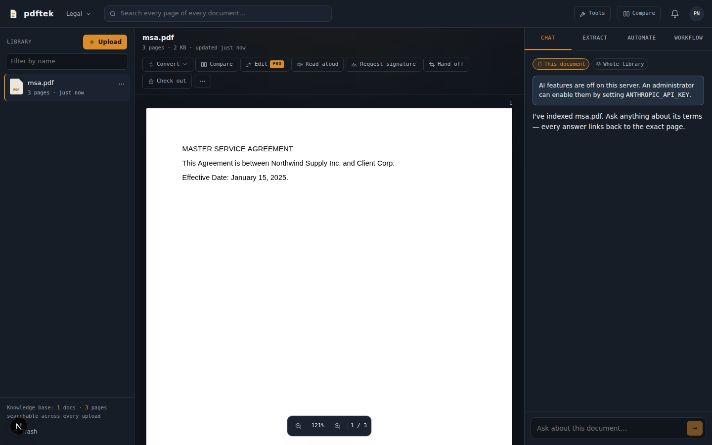

# pdftek

**pdftek is a document workbench for professional teams.** One secure workspace covers uploading, converting, editing, signing, searching and understanding documents. AI answers always cite the page they came from.



## Features

| Area | What you get |
| --- | --- |
| **Library & knowledge base** | Multi-workspace document library with tags, trash and restore. Every page is indexed with SQLite FTS5, so you can search by file name or full text across all documents, with hit snippets that jump to the page. |
| **Upload anything** | PDF, DOCX/PPTX/XLSX/ODT/RTF (via LibreOffice), TXT/MD/CSV, JPG/PNG/WEBP/HEIC/TIFF, and **camera scanning** with auto-crop and enhance. Also **images → PDF** with drag-to-reorder. |
| **Viewer** | pdf.js rendering with a selectable text layer, lazy page loading, zoom, and citation/search highlighting. |
| **Convert** | PDF to Word, Excel (tables become cells), PowerPoint, plain text, and JPG/PNG/WEBP/TIFF for all pages or just the current one. Server-side LibreOffice gives higher-fidelity Word output when it's installed. |
| **Edit (Pro)** | Click any line to rewrite it. Add styled text (bold/italic/underline, serif/sans, size, color), place and resize images, highlight, white out, and **truly redact**: redacted pages are flattened to images so the hidden text is gone. Undo/redo, draft autosave, and each save becomes a new version. |
| **AI assistant** | Chat with a document or the **whole library**. Answers stream in with clickable page citations. **Extract** key terms, dates and deadlines, parties, obligations, financial figures, tables, custom fields, and **risk flags checked against your team playbook**. Results export to Excel/CSV. |
| **Compare** | Word-level redline of any two documents or versions, a "changes only" view, and an AI summary of material changes. |
| **E-signatures (Pro)** | Place signature, initials, date, name and text fields for each signer. Signing can be in parallel or in order. Signers draw or type, give consent, and can decline. Reminders are supported. The signed PDF gets a **certificate of completion** listing IP addresses, timestamps, user agents and the original document's SHA-256. |
| **Document requests (Pro)** | Collect files from clients through secure upload links, with due dates, reminders and status tracking (pending → viewed → complete). |
| **Automations (Pro)** | Triggers: document uploaded, schedule (digest), renewal coming up (N days out), signature completed, request fulfilled. Actions: extract, summarize, tag, assign, notify, email, and HTTPS webhooks that are Slack-compatible and blocked from private hosts. Every run is logged. |
| **Teams** | Invites, owner/admin/member roles, check-out locks against conflicting edits, hand-offs with notes, an activity feed, in-app notifications, and email. |
| **Also** | Read aloud (Web Speech, 11 languages, speed control), in-browser OCR (Tesseract, 13 languages), merge, split, extract, delete, rotate, drag-to-organize pages, watermark, page and Bates numbering, optimize, metadata, version history with restore. |
| **Business** | Marketing site, pricing, Free/Pro/Business plans, a 14-day trial, and optional Stripe Checkout, Customer Portal and webhooks. |

## Quick start

```bash
cp .env.example .env        # add ANTHROPIC_API_KEY to enable AI features
npm install
npm run dev                 # http://localhost:3000
```

Requires **Node.js 22.13+**, because the database uses the built-in `node:sqlite`.

### Production (Docker)

```bash
docker compose up -d --build
```

The image includes LibreOffice for Office conversions. All state (the SQLite database and uploaded files) lives in the `/data` volume, so back that volume up.

## Configuration

| Variable | Purpose |
| --- | --- |
| `APP_URL` | Public base URL, used in emails and share links. |
| `DATA_DIR` | Where the database and files are stored (default `./data`). |
| `ANTHROPIC_API_KEY` | Enables chat, extraction, summaries, compare insights and AI automation steps. |
| `PDFTEK_AI_MODEL` | Overrides the model (default `claude-opus-5`). |
| `SMTP_URL`, `MAIL_FROM` | Outbound email. Without them, emails are logged, and the UI offers copyable links instead. |
| `STRIPE_SECRET_KEY`, `STRIPE_WEBHOOK_SECRET`, `STRIPE_PRICE_PRO`, `STRIPE_PRICE_BUSINESS` | Online billing. Point the Stripe webhook at `/api/stripe/webhook`. |
| `SOFFICE_PATH` | Custom LibreOffice binary path. It is auto-detected otherwise. |
| `PDFTEK_DISABLE_SCHEDULER=1` | Turns off the in-process automation scheduler, e.g. on extra replicas. |

## Architecture

- **Next.js 15 (App Router) + React 19 + TypeScript.** Route handlers under `src/app/api` return JSON and are wrapped by `route()` (`src/lib/http.ts`), which handles same-origin checks, zod validation and uniform errors.
- **Data:** `node:sqlite` with WAL and FTS5 for page-level full-text search (`src/lib/db.ts`). Files are stored on disk under `DATA_DIR/files` (`src/lib/storage.ts`). Each document version is an immutable file with a SHA-256 hash.
- **Auth:** email and password (scrypt). Sessions are random tokens stored hashed, in an httpOnly SameSite=Lax cookie. Every API call checks workspace membership and role (`requireMember`). Login and signup are rate-limited.
- **PDF engine:** pdf-lib for page operations, stamping, editing and signatures, on both server and client. pdf.js renders in the browser and extracts text on the server. LibreOffice converts Office files.
- **AI:** Anthropic SDK (`src/lib/ai.ts`). PDFs are sent as `document` blocks with citations enabled and prompt caching on the document prefix. Extraction uses structured outputs (JSON schema). Server-side refusal fallbacks are enabled (`fallbacks: "default"`). Library chat retrieves the best pages with FTS5 and sends them as citable documents.
- **Automations:** an in-process scheduler started from `src/instrumentation.ts` ticks every minute. Event triggers fire from uploads, signature completion and fulfilled requests.

## Project layout

```
src/
  app/                 pages (marketing, auth, workbench, settings, tools, compare, sign, request) and API routes
  components/          UI: workbench panes, PDF viewer, editor, signature pad, modals
  lib/                 server modules (db, auth, documents, pdf, ai, signing, automations, mail, stripe)
  lib/client/          browser helpers (api, pdf.js, converters, images)
```

## Scripts

- `npm run dev`: development server
- `npm run build && npm start`: production build and server
- `npm run typecheck`: TypeScript
- `npm run lint`: ESLint
